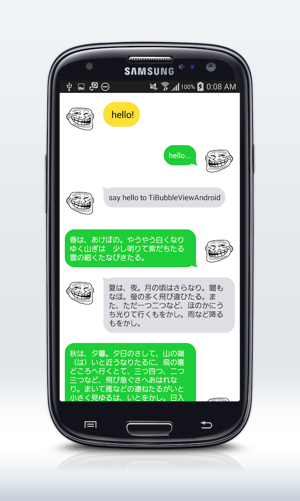

# TiBubbleView for Android

This is a Titanium Mobile Mobile module (for Android) project 
that TiBubbleView <https://github.com/k0sukey/TiBubbleView> ported to Android.





## Install

[Compiled module download](android/dist/com.tdtsh.tibubbleandroid-android-1.0.0.zip)


Register your module with your application by editing `tiapp.xml` and adding your module.
Example:

```
<modules>
	<module platform="android">com.tdtsh.tibubbleandroid</module>
</modules>
```

When you run your project, the compiler will combine your module along with its dependencies
and assets into the application.


## Usage

You can see screenshot's example at [example/app.js](example/app.js).

```javascript
var label = Ti.UI.createLabel({
	top: 10,
	right: 10, // or 14 (consider the bubble beak)
	bottom: 10,
	left: 14, // or 10 (consider the bubble beak)
	width: Ti.UI.SIZE,
	height: Ti.UI.SIZE,
	color: '#fff',
	textAlign: Ti.UI.TEXT_ALIGNMENT_LEFT,
	verticalAlign: Ti.UI.TEXT_VERTICAL_ALIGNMENT_TOP,
	text: 'hello, world'
});

var TiBubble = require('com.tdtsh.tibubbleandroid');
var bubble = TiBubble.createView({
	top: 0,
	left: 10,
	width: Ti.UI.SIZE, // just fit from contained label
	height: Ti.UI.SIZE, // just fit from contained label
	bubbleColor: '#dfdee5', // default: #fff
	bubbleRadius: 20, // default: 20
	bubbleBeak: TiBubble.bubbleBeakLeft // default BUBBLE_BEAK_LEFT
	bubbleBeakVertical: TiBubble.bubbleBeakUpper // default BUBBLE_BEAK_LOWER
});
bubble.add(label);
```

### Properties

>> Caution! There is a little difference from iOS version

* bubbleColor
* bubbleRadius
* bubbleBeak / TiBubble.bubbleBeakLeft or TiBubble.bubbleBeakRight
* bubbleBeakVertical / TiBubble.bubbleBeakLower or TiBubble.bubbleBeakUpper

## Credits

Original TiBubbleView <https://github.com/k0sukey/TiBubbleView> by Kosuke Isobe


## License

The MIT License (MIT) Copyright (c) 2014 Tadatoshi Hanazaki

